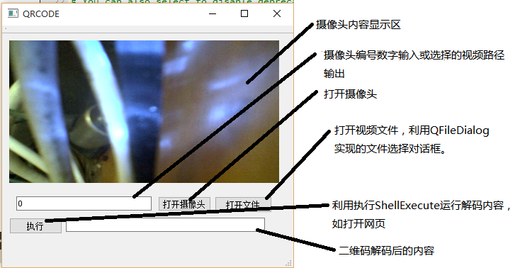
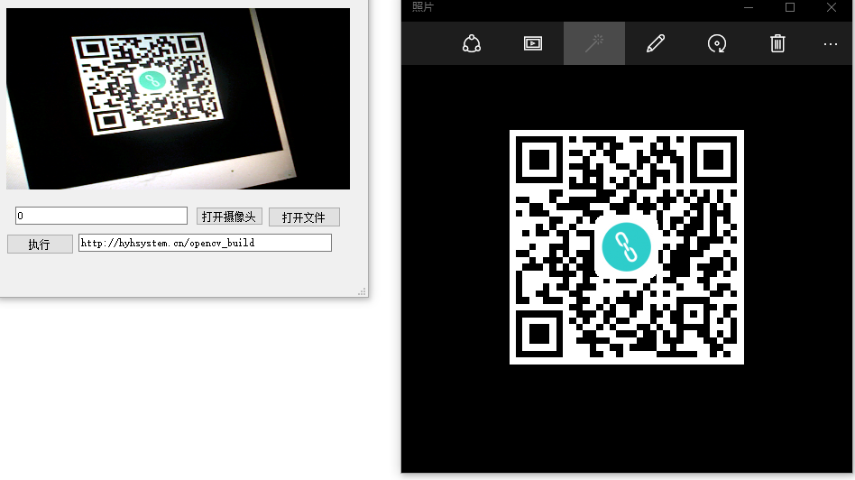
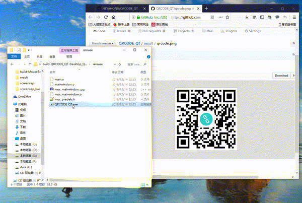

# 视频二维码扫描   
1.说明    
此工程在MSYS2 mingw32环境+Qt5+opencv4.0编译成功并成功运行，由于使用了ShellExecute这个windows的API,只能在windows平台运行。    
二维码检测及识别采用opencv的QRCodeDetector   
测试用二维码(链接为opencv已编译的mingw32版库文件):   
  
2.QT工程说明   
要想正常编译运行此工程，必须配置好opencv库的头文件目录，链接库文件目录和dll文件目录。     
  
3.窗口说明及结果。  
  
  
  