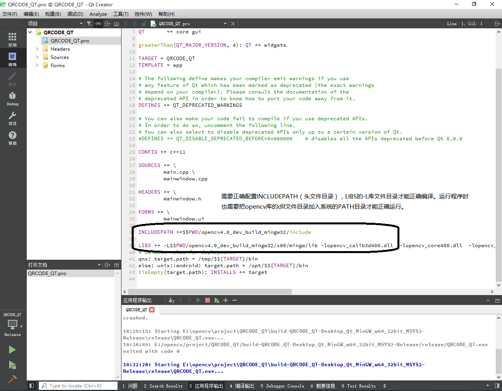

# ???????    
1.??    
????MSYS2 mingw32??+Qt5+opencv4.0???????????ShellExecute??windows?API,????windows????????     
?????????opencv?QRCodeDetector??????   
??????(????opencv??????):   
  
2.???????   
???????????,?????opencv?????????,???????,opencv?dll????????????PATH??(?dll???PATH???????)?   
  
3.?????????  
  
  